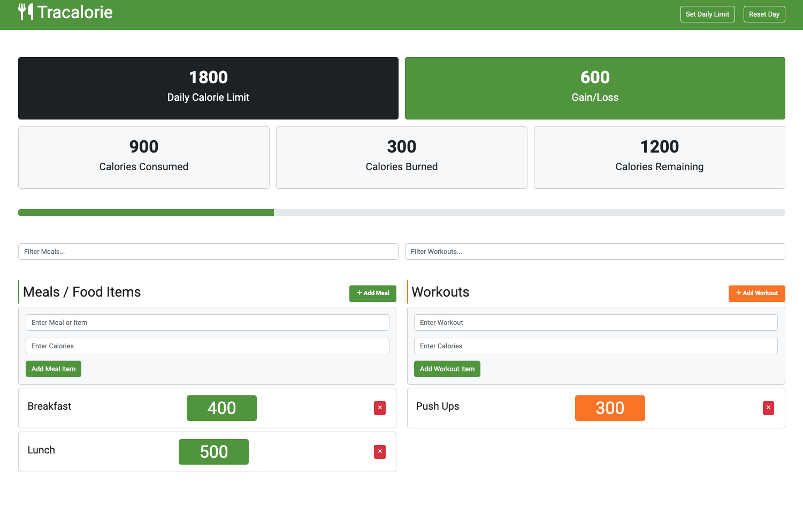

# Tracalorie App

This is a simple calorie counter app built with vanilla JavaScript. It tracks your meals and workouts and calculates the total calories burned and consumed.

There is a version of this app built with Webpack in the `webpack` branch.

Deployed on Netlify:
[Tracalorie](https://subtle-meerkat-8d419f.netlify.app)